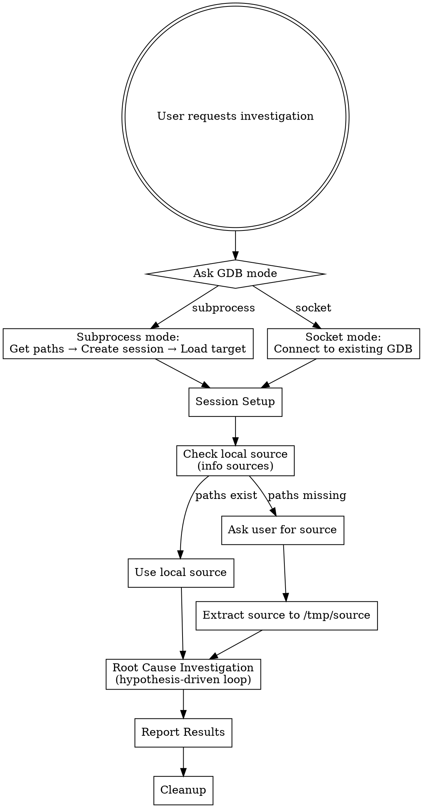
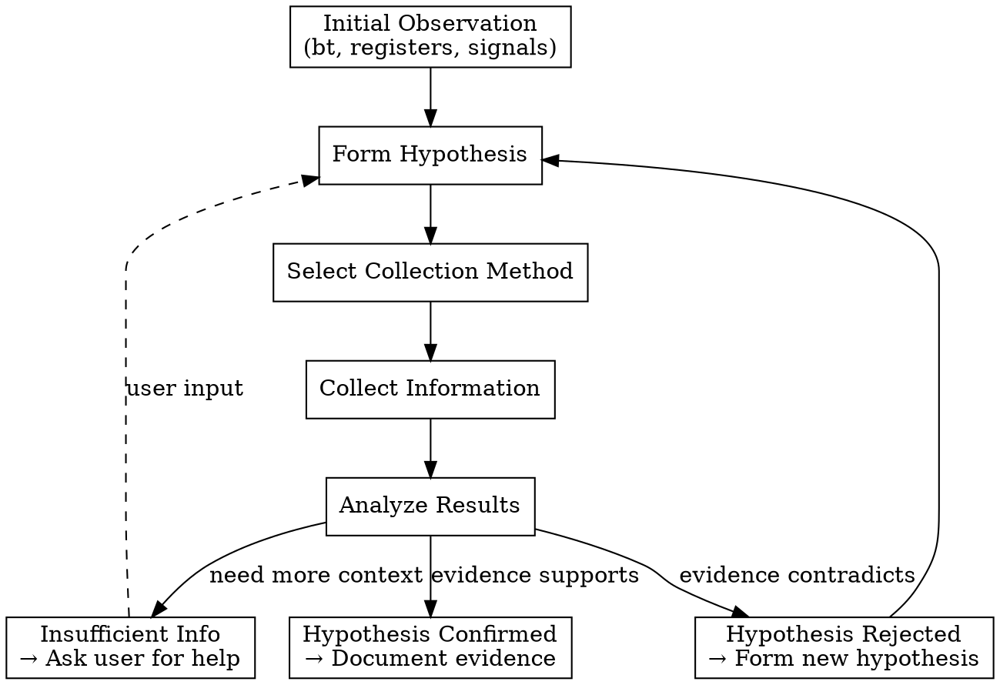

# Auto-GDB Investigation

## Overview

Root cause investigation skill for production debugging with auto-gdb MCP. Supports coredumps, performance issues, and anomalies where source code is typically unavailable.

**Core principle:** Hypothesis-driven investigation - every action tests a hypothesis, collect information from multiple sources (GDB, shell, source, knowledge base, user).

## Configuration

Default values (user can override during session):

| Setting | Default | Description |
|---------|---------|-------------|
| `knowledge_base_mcp` | `knowledge-base` | Knowledge base MCP server name |
| `source_path` | `/tmp/source` | Path to extract source code |
| `archive_path` | `/tmp/source.tar.gz` | Path for downloaded archive |
| `gdb_timeout_sec` | `15` | Default GDB command timeout |
| `cleanup_on_exit` | `true` | Clean up source/archive after investigation |

## Overall Workflow



## Phase 1: Preparation

### 1.1 Determine GDB Mode

Ask user which mode:

| Mode | When to Use | What You Need |
|------|-------------|---------------|
| **Subprocess** | Starting fresh investigation | Binary path, optionally coredump path |
| **Socket** | User already has GDB running and listening on domain socket | Socket path (user ran `auto-gdb listen`) |

### 1.2 Session Setup

**Subprocess mode:**
```
create_session(cwd="<working_dir>")
gdb_command: "file /path/to/binary"
gdb_command: "core /path/to/coredump"  # if applicable
```

**Socket mode:**
```
create_session(socket_path="/path/to/socket")
```

**Note:** In **socket** mode, the inferior's stdout and stderr are not captured through the auto-gdb/MCP connection. Redirect program output to files when starting it (e.g. when using `run`), then read those files.

### 1.3 Acquire Source Code

Check if source is already available locally before asking user.

**Step 1: Check local source availability**

```
gdb_command: "info sources"
```

This returns source file paths compiled into debug info.

**Step 2: Verify paths are accessible**

For the paths returned, check if files exist:
```bash
ls -la /path/from/debug/info/file.c
```

**Step 3: Act based on result**

| Situation | Action |
|-----------|--------|
| Paths exist and accessible | Use local source, skip asking user |
| Paths missing or inaccessible | Ask user: "Please provide source path or URL" |

**Note:** Debug info often contains build-time paths (e.g., `/home/buildbot/project/src/file.c`) that don't exist on production machines. If paths from `info sources` don't exist locally, treat as "paths missing" and ask user for source.

**User provides source:**

1. **URL** - Downloadable link
   ```bash
   wget -O /tmp/source.tar.gz "<URL>"
   mkdir -p /tmp/source
   tar -xzf /tmp/source.tar.gz -C /tmp/source
   ```

2. **Local path** - Already on machine
   ```bash
   tar -xzf /path/to/archive.tar.gz -C /tmp/source
   ```

### 1.4 Discover Available Tools

After GDB session is ready:

```
gdb_command: "help user-defined"
```

Review output to identify project-specific debugging commands (e.g., `info-coroutines`, `dump-heap`).

## Phase 2: Investigation

Investigation is **hypothesis-driven**, not blind collection.

### Process Flow



### Initial Observation

Start with minimal commands to understand the situation:

1. `bt` - Backtrace to see where we are
2. `info registers` - Check for obvious anomalies (null pointers, error codes)
3. Look for crash signals, error indicators, unusual values

### Information Collection Toolbox

| Tool | Usage | Examples |
|------|-------|----------|
| **GDB commands** | Inspect program state | `bt`, `print`, `info registers`, `info locals`, `frame N` |
| **GDB user-defined** | User defined gdb commands | use `help user-defined` to see |
| **GDB shell** | External commands | `shell grep`, `shell tail`, `shell cat /proc/...` |
| **Source code** | Understand behavior | Use Glob/Grep/Read on `/tmp/source/` |
| **Knowledge base MCP** | Historical context | Search similar issues, known patterns |
| **Ask user** | Fill gaps | Business context, environment, recent changes |

### Hypothesis Examples

- "Null pointer dereference in function X"
- "Memory corruption due to buffer overflow"
- "Coroutine leak causing resource exhaustion"
- "Configuration change causing timeout"

### When to Ask User

Ask proactively when:
- Cannot access needed files (permissions, missing)
- Multiple hypotheses equally plausible
- Need business/domain context
- Need environment or deployment details
- User may have direct knowledge of recent changes
- Investigation is stuck

## Phase 3: Knowledge Base Integration

Knowledge base MCP is an external document search service.

**Assumed interfaces:**
- Search: accepts keywords → returns document list (title + summary)
- Fetch: returns full document content (JSON/YAML/HTML)

### Integration Points

| Timing | Trigger | Action |
|--------|---------|--------|
| Investigation start | User initiates | Search with project name, error type, crash function |
| During investigation | Form hypothesis | Search with hypothesis-related keywords |
| Anytime | User requests | "Check knowledge base for similar issues" |

### Result Handling

1. Display document titles and summaries
2. Evaluate relevance based on current hypothesis
3. User can select which documents to read in detail
4. Incorporate findings into investigation

## Phase 4: Reporting

Report structure adapts to outcome.

### With Conclusive Finding

```
Problem: <one-line description>
Root Cause: <determined cause>
Evidence:
  - <key GDB output>
  - <relevant source code>
  - <knowledge base reference if applicable>
Recommendation: <fix or next steps>
```

### Without Conclusive Finding

```
Problem: <one-line description>
Anomalies Observed:
  - <abnormal finding 1>
  - <abnormal finding 2>
Current Hypotheses:
  - [High] <hypothesis 1>
  - [Medium] <hypothesis 2>
Evidence:
  - <key findings so far>
Next Steps:
  - <suggested action 1> (e.g., "info-coroutines -blocked")
  - <question for user>
  - <suggested action 2>
```

**Key point:** Conclusions are not required. Anomalies + hypotheses are valuable output.

## Phase 5: Cleanup

After investigation concludes, clean up resources.

### What to Clean Up

| Resource | Path | Action |
|----------|------|--------|
| Source code directory | `/tmp/source/` | `rm -rf /tmp/source` |
| Downloaded archive | `/tmp/source.tar.gz` | `rm -f /tmp/source.tar.gz` |
| GDB session | - | `stop_session` if subprocess mode |

### Cleanup Behavior

- **Default:** Automatic cleanup after report (configurable via `cleanup_on_exit`)
- **Skip:** If user wants to keep source for further investigation
- **Ask:** If unsure, confirm with user

**Socket mode:** Do NOT stop GDB session - it belongs to user. Only clean up files.

## Error Handling

### Preparation Phase

| Error | Resolution |
|-------|------------|
| Download URL fails | Report error, ask for alternative URL or local path |
| Archive extraction fails | Check format, ask user to re-provide |
| GDB session creation fails | Check error, guide user (socket missing, permissions) |
| Source/binary version mismatch | Warn user, line numbers may not match |

### Investigation Phase

| Error | Resolution |
|-------|------------|
| GDB command timeout | Warn user, may need to adjust timeout |
| Knowledge base MCP unavailable | Skip KB, continue investigation, inform user |
| Permission denied | Inform user, ask for alternative access |
| Shell command fails | Check error output, try alternatives |

## Common Mistakes

| Mistake | Solution |
|---------|----------|
| Blindly collecting data without hypothesis | Form hypothesis first, then collect targeted evidence |
| Not asking user for help when stuck | Proactively ask when multiple hypotheses or missing context |
| Forgetting to check user-defined commands | Run `help user-defined` early to discover project tools |
| Not cleaning up after investigation | Always run cleanup phase unless user wants to keep |
| Stopping GDB session in socket mode | Socket mode GDB belongs to user - only cleanup files |
| Source code doesn't match binary behavior | User-provided source may not match program version. Ask user to confirm source version if code analysis contradicts GDB state. |

## Key Principles

1. **Hypothesis-driven** - Every action should test a hypothesis
2. **Multi-tool approach** - Use GDB, shell, source, knowledge base, user input as needed
3. **Proactive communication** - Ask user when stuck or need context
4. **Iterative refinement** - Rejected hypotheses lead to new hypotheses
5. **Flexible reporting** - Conclusion not required; anomalies + hypotheses are valuable output